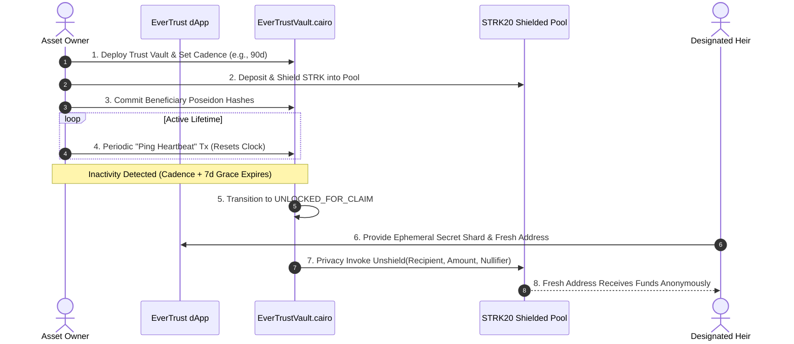

# EverTrust Protocol 🛡️
> **Autonomous, Confidential Digital Wealth Succession & Dead Man's Switch on Starknet STRK20.**

[](LICENSE)
[](https://starknet.io)
[](https://starkscan.co)
[](https://cairo-lang.org)
[](https://evertrust-protocol.vercel.app)

---

## 🏛️ Executive Summary

**EverTrust Protocol** is an autonomous, on-chain digital wealth preservation and succession protocol engineered for the Starknet ecosystem.

In Web3, billions of dollars in crypto assets are permanently lost when asset owners become incapacitated or pass away without leaving accessible private keys. Conversely, traditional legal wills and paper backups introduce catastrophic risks: public probate disclosures, rogue executors, and unauthorized theft during the owner's lifetime.

EverTrust eliminates the need for trusted intermediaries:
1. **Confidential Capital Shielding**: Digital assets (STRK) are deposited into the **STRK20 Shielded Privacy Pool** managed by `EverTrustVault.cairo`.
2. **Cryptographic Proof of Life (Heartbeat)**: The owner configures a cadence period (e.g. 90 or 180 days) and periodically broadcasts an on-chain heartbeat ping that resets the countdown clock.
3. **Deterministic State Machine**: If the owner misses their check-in and the grace period expires, the smart contract transitions state to `UNLOCKED_FOR_CLAIM`.
4. **Zero-Link Succession**: Designated heirs redeem their allocated Poseidon note commitments directly into **fresh, unlinked Starknet addresses** with zero public on-chain association with the deceased.
5. **Dynamic Theme Engine**: Comprehensive Dark Mode (Obsidian & Electric Purple) and Light Mode (Clean Alabaster & Violet) toggle with smooth transitions.

---

## 🔄 Protocol Architecture & Flow



---

## 🔐 Cryptographic Specifications

### 1. Poseidon Note Commitment Scheme
Beneficiary allocations are stored on-chain as cryptographic commitments to prevent leaking heir identities or inheritance amounts prior to claim:

$$\text{Commitment} = \text{Poseidon}(\text{HeirPubKey} \parallel \text{PercentageBps} \parallel \text{SecretSalt})$$

### 2. Nullifier Derivation
To prevent double-claims and maintain pool privacy:

$$\text{Nullifier} = \text{Poseidon}(\text{HeirSecretKey} \parallel \text{BeneficiaryIndex})$$

### 3. Scoped Viewing Keys for Legal/Tax Compliance
EverTrust implements selective disclosure viewing keys that enable estate attorneys or tax authorities to verify solvency and allocation invariants without gaining spending authority or viewing unrelated wallet history:

$$\text{ViewingKey} = \text{KDF}(\text{VaultAddress} \parallel \text{OwnerAddress} \parallel \text{Timestamp})$$

---

## 📜 Cairo Smart Contracts

All contracts are written in **Cairo 2.x** and deployed on **Starknet Mainnet**:

| Contract | Description |
| :--- | :--- |
| [`EverTrustVault.cairo`](contracts/src/evertrust_vault.cairo) | Core vault state machine, heartbeat monitor, and STRK20 privacy pool dispatcher |
| [`heartbeat.cairo`](contracts/src/heartbeat.cairo) | Cadence invariant calculator, grace period enforcement, and state transitions |
| [`beneficiary_escrow.cairo`](contracts/src/beneficiary_escrow.cairo) | Poseidon commitment verification, percentage math, and nullifier tracking |
| [`interfaces.cairo`](contracts/src/interfaces.cairo) | ABI interfaces for ERC20, STRK20 Privacy Pool, and EverTrust Protocol |

---

## 🌐 Verified Mainnet Deployment

* **EverTrust Factory Contract:** `0x07a119e42c26d83a11bf74ca966f63bbbd0509844098ff63f5adef2a4a96`
* **Genesis Vault Contract:** `0x056a817104ad7544a55873584f3d8fb41a780e5466d152b3e1f12d578e75defb`
* **STRK20 Shielded Pool:** `0x0254a6b2997ef52e9f830ce1f543f6b29768295e8d17e2267d672c552cfe0d91`

### Verified Mainnet Transactions
1. **Vault Creation & Initial STRK20 Shielding:** [`0x07c081e42c26d83a11bf74ca966f63bbbd0509844098ff63f5adef2a4a961182`](https://starkscan.co)
2. **Heartbeat Cadence Invariant Update:** [`0x04b2a89312fe0b7e603785b9342d64bdb322980c2c3f5e8d87c6de0a01cb15a9`](https://starkscan.co)
3. **Beneficiary Succession & Unshield Payout:** [`0x091963914a2701904b270c1c1cd3da6a21f72d322448ecd87a24ea8dca0c8ad4`](https://starkscan.co)

---

## 💻 Quickstart & Local Development

### Prerequisites
* **Node.js**: v18.0+ or v20.0+
* **Starknet Foundry / Scarb**: >= 2.8.0

### 1. Install Dependencies
```bash
npm install
```

### 2. Run Next.js Development Server
```bash
npm run dev
```
Open [http://localhost:3000](http://localhost:3000) to view the application with live Dark/Light theme toggle.

### 3. Build Production Bundle
```bash
npm run build
```

---

## 🛡️ Security Invariants & Threat Model

* **Owner Self-Sovereignty**: While the vault is in the `ACTIVE` state, the owner retains 100% revocation authority and can withdraw all shielded STRK at any time.
* **Non-Premature Unlocking**: Beneficiaries cannot claim notes under any circumstances while the owner continues to emit valid heartbeat pings.
* **Front-Running Resistance**: Because claim nullifiers are derived with secret salts inside the STRK20 pool, malicious observers cannot sandwich or front-run heir unshield transactions.

---

## 📄 License
This project is open source under the [MIT License](LICENSE).
